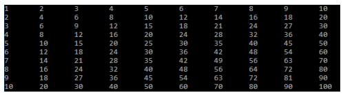
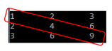

# Array Exercises

## 1. Store and Print Elements
Write a program which will store elements in an array of type `int` and print it out.
- **Expected output**: `11 23 39` etc.

## 2. Find Index of an Element
Create a program and create a method named `indexOf` which will find and return the index of an element in the array. If the element doesn’t exist, your method should return -1 as value.
- **Expected output**: `Index position of number 5 is: 2`

## 3. Sort String Array
Write a program which will sort a string array.
- **Expected output**:
    - `String array: [Paris, London, New York, Stockholm]`
    - `Sort string array: [London, New York, Paris, Stockholm]`

## 4. Copy Array Elements
Write a program which will copy the elements of one array into another array.
- **Expected output**:
    - `Elements from first array: 1 15 20`
    - `Elements from second array: 1 15 20`

## 5. Two-Dimensional Array
Create a two-dimensional string array `[2][2]`. Assign values to the 2-dimensional array containing any Country and City.
- **Expected output**:
    - `France Paris`
    - `Sweden Stockholm`

## 6. Calculate Average
Write a program which will set up an array to hold the following values: `43, 5, 23, 17, 2, 14` and print the average of these 6 numbers.
- **Expected output**: `Average is: 17.3`

## 7. Print Uneven Numbers
Write a program which will set up an array to hold 10 numbers and print out only the uneven numbers.
- **Expected output**:
    - `Array: 1 2 4 7 9 12`
    - `Odd Array: 1 7 9`

## 8. Remove Duplicates
Write a program which will remove the duplicate elements of a given array `[20, 20, 40, 20, 30, 40, 50, 60, 50]`.
- **Expected output**:
    - `Array: 20 20 40 20 30 40 50 60 50`
    - `Array without duplicate values: 20 40 30 50 60`

## 9. Add Elements to Array
Write a method which will add elements to an array. Remember that arrays are fixed in size so you need to come up with a solution to “expand” the array.

## 10. Multiplication Table
Write a program which will represent a multiplication table stored in a multidimensional array.
- **Hint**: You have a two-dimensional array with values `[[1,2,3,4,5,6,7,8,9,10], [1,2,3,4,5,6,7,8,9,10]]`.

## 11. Reverse User Input
Write a program that asks the user for an integer and repeats that question until the user gives you a specific value that the user has been told about as a message in your program. Store these values in an array and print that array. After that, reverse the array elements so that the first element becomes the last element, the second element becomes the second to last element, etc. Do not just reverse the order in which they are printed. You need to change the way they are stored in the array.

## 12. Print Diagonal Elements
Write a program which will print the diagonal elements of a two-dimensional array.
- **Expected output**: `1 4 9`

## 13. Rearrange Even and Odd Numbers
Create two arrays with arbitrary size and fill one with random numbers. Then copy over the numbers from the array with random numbers so that the even numbers are located in the rear (the right side) part of the array and the odd numbers are located in the front part (the left side).

[Link to Access the Arrays_Exercises.pdf](assets/Exercises_Array.pdf)
